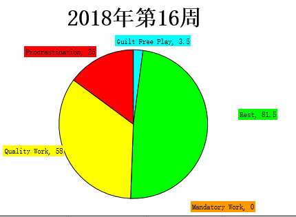
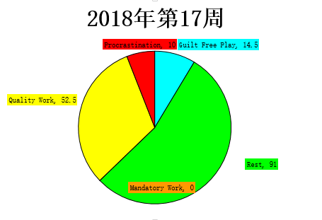
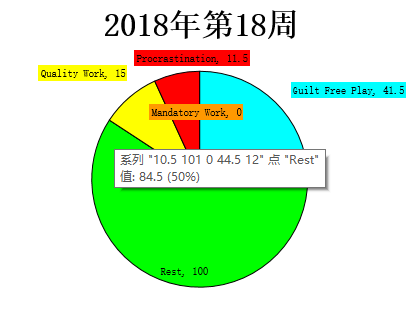
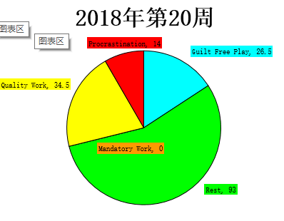

# 2018 okr制定

## 第二季度

- 《深入理解java虚拟机》学习完
- 学习完《java并发编程》并整理学习笔记
- 《leetcode题解》书籍写到80题
- ~~驾照过掉科目1~~ (5.14完成)
- 这个Q练出腹肌

# 第三季度

* 学完公开课:[Deep Learning for Natural Language Processing](http://cs224d.stanford.edu/index.html)
* 《leetCode题解》书籍出到160

# 2018 okr跟踪

## 第16周（4.16~4.22）

### 进度

* 大致看完了《并发编程实战》
* 学习了localThread的作用
* 写书《leetcode题解》写了3道题解

### 不足

* 浪费时间较多，没有规律作息
* 健身坚持得不好

## 第17周（4.23~4.29）

- jvm推进到第三章,之前的逻辑也比较清晰。本周继续。

- 《leetcode题解》书没进展
- 其他没进展，下周抓紧
- 这周去长岛玩了一次，5.1长假

##  第18周（4.30~5.6）

- 基本没进展
- 躺尸的一周，下周改掉

# 第20周（5.14~5.20）

* 科目一考试98分
* 看了redis的相关内容.

