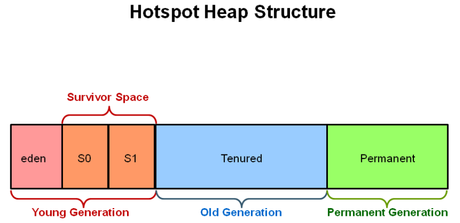

# gc算法分类

## 标记-清除算法

算法实现：

* 标记。
* 清除。

缺点：

* 标记和清除两个阶段效率不高
* 会产生内存碎片，无法分配大对象

## 复制算法

为了解决 **标记-清除算法的效率不高** 的问题。

算法实现：

* 将可用内存按容量划分为大小相等的两块，每次只使用其中的一块
* 当这一块的内存用完了，就将还存活着的对象复制到另外一块上面
* 一次性清除使用过的内存

优点：

* 只需要移动一下指针，顺序分配内存即可，效率高
* 同时也不会有内存碎片的问题

缺点：

* 内存缩小为原来的一半
* 如果存活的对象比较多的时候就会复制较多的存活对象，效率降低

根据缺点知道，适用于对象被频繁创建和GC的场景，如果对象长期存在的较多，那么就会导致花费大量时间在复制存活对象上，效率降低。

## 标记-整理算法

为了解决 **复制算法内存占用过高、复制较多存活对象效率**问题而设计。

算法实现：

* 标记
* 整理的时候让存活对象向一端移动，直接清理掉边界以外的内存。

# GC分代

## 为什么要分代?

* 对象的**生命周期** 不一样。有的对象是“朝生夕死”，有的对象存活的时间就比较长。
* 如果不分代，我们要对对的所有区域进行扫描，**效率** 不高
* 充分发挥不同**GC算法** 。

## 如何分代

### 年轻代

存放生命周期较短的对象。一般使用**复制算法**进行GC.

* 构成：`Eden`区、2个`Survivor`区（分别叫`from`和`to`）。
* GC:
  * 最开始对象存在于: `Eden`区和`Survivor` 的`from`, `To `区是空的。
  * 进行GC，
    * `Eden`区：所有存活对象被复制到 `To`
    * from区：大于`XX:MaxTenuringThreshold`移到年老代, 反之复制到`To`
  * Eden 和 from区已经被清空，被清空的from区就相当于最开始的To区域 
  * 回到最开始的状态
* 相关参数
  * -Xms 20M ：最小堆内存
  * -Xmx 20M： 最大堆内存
  * -Xmn 10M：新生代大小
    * -XXSurvivorRatio=8 新生代中`Eden`区和**其中一个** Survivor区的比例( **8:1:1**)。
    * eden space: 8192k
    * from space: 1024k
    * to space: 1024k
* 为什么很多服务都把 -Xms 和 -Xmx都设置成一样？
  * 减少初期GC带来的抖动
  * 避免JVM在运行过程中向OS申请内存,发生内存抖动

### 年老代

存放生命周期长的对象。经历过N次回收之后，仍然存活的对象。一般使用**标记-整理**算法GC，但是常用的CMS是标记-清除算法。

### 永久代

对应前一篇笔记的：方法区。常量、类等。

## GC的触发

- Partial GC：并不收集整个GC堆的模式

  * Young GC：只收集young gen的GC

  - Old GC：只收集old gen的GC。只有CMS的concurrent collection是这个模式
  - Mixed GC：收集整个young gen以及部分old gen的GC。只有G1有这个模式

- Full GC：收集整个堆，包括young gen、old gen、perm gen（如果存在的话）等所有部分的模式。

Major GC通常是跟full GC是等价的，收集整个GC堆。但因为HotSpot VM发展了这么多年，外界对各种名词的解读已经完全混乱了，当有人说“major GC”的时候一定要问清楚他想要指的是上面的full GC还是old GC。

- young GC：当young gen中的**eden区分配满**的时候触发。注意young GC中有部分存活对象会晋升到old gen，所以young GC后old gen的占用量通常会有所升高。
- full GC：
  - 当准备要触发一次young GC时，如果发现统计数据说之前young GC的平均晋升大小比目前old gen剩余的空间大，则不会触发young GC而是转为触发full GC（因为HotSpot VM的GC里，除了CMS的concurrent collection之外，其它能收集old gen的GC都会同时收集整个GC堆，包括young gen，所以不需要事先触发一次单独的young GC）；
  - 或者如果有perm gen的话，要在perm gen分配空间但已经没有足够空间时，也要触发一次full GC；
  - 或者System.gc()、heap dump带GC，默认也是触发full GC。

