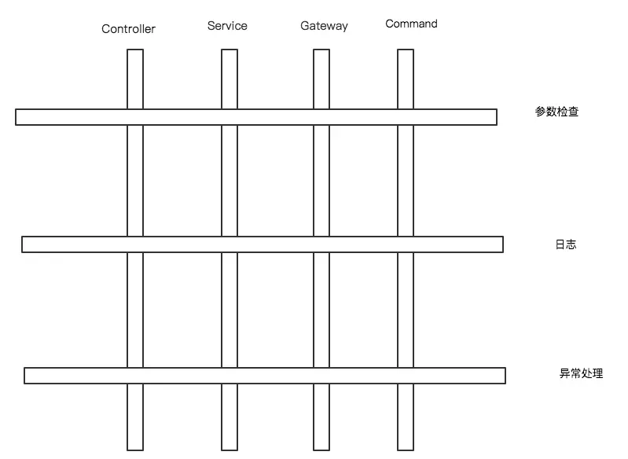

# Why

Api抽象可以比较好的解决业务级别的开发，但是系统级别的开发没有检测到。比如、对于每一个模块需要进行打日志、代码监控、异常处理。以打日志为例，我只能将日志代码嵌套在各个对象上，而无法关注日志本身，而这种现象又偏离了OOP思想。



OOP属于一种**横向扩展**，AOP是一种**纵向扩展**。AOP依托于OOP，进一步将系统级别的代码抽象出来，进行纵向排列，实现低耦合。

# 组成

* **PointCut**：即在哪个地方进行切入，它可以指定某一个点，也可以指定多个点。通常可以用正则表达式来定义多个类的多个方法；
* **Advice**： 在切入点干什么，指定在PointCut地方做什么事情（增强），打日志、执行缓存、处理异常等等；
* **Aspect**： PointCut + Advice 形成了切面Aspect，这个概念本身即代表切面的所有元素。如何将切面植入到代码中？答案是利用Proxy。
* **Proxy:** Proxy 即代理，其不能算做AOP的家庭成员，更相当于一个管理部门，它管理 了AOP的如何融入OOP。之所以将其放在这里，是因为Aspect虽然是面向切面核心思想的重要组成部分，但其思想的践行者却是Proxy,也是实现AOP的难点与核心据在。**Aop 是一种思想，Proxy是这种思想的实现。**

# 代理

Aop的实现核心是代理，代理通常有两种模式：**jdk代理**和**cglib代理**。

[Spring AOP 原理](http://www.jianlizhang.com/2018/08/30/Spring-AOP-proxy/)

[源码](https://github.com/Acceml/SpringAOPDemo)

# Sping-Aop的实现

spring-Aop封装了两个代理：**CglibProxyFactory**和**JdkDynamicAopProxy**， 如果代理的类实现了接口，默认会使用jdk动态代理。

```java
public class DefaultAopProxyFactory implements AopProxyFactory, Serializable {
	...
	public AopProxy createAopProxy(AdvisedSupport config) throws AopConfigException {
		if (config.isOptimize() || config.isProxyTargetClass() || hasNoUserSuppliedProxyInterfaces(config)) {
			Class targetClass = config.getTargetClass();
			if (targetClass == null) {
				throw new AopConfigException("xxx");
			}
			if (targetClass.isInterface()) {
				//是接口, 默认使用jdk动态代理.
				return new JdkDynamicAopProxy(config);
			}
			if (!cglibAvailable) {
				throw new AopConfigException(
						"xxx");
			}
			return CglibProxyFactory.createCglibProxy(config);
		}
		else {
			return new JdkDynamicAopProxy(config);
		}
	}
}
```

