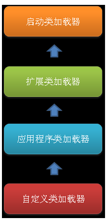
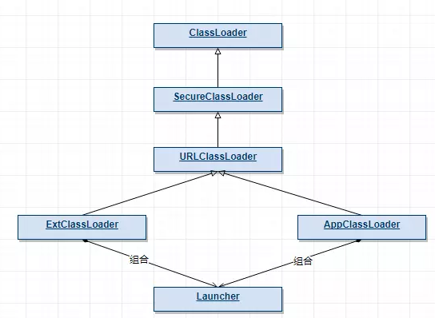
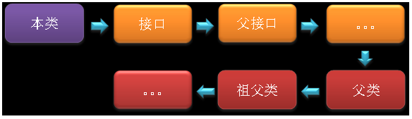

类加载机制：虚拟机把描述类的数据从class文件加载到类，并对数据进行校验、转换解析、初始化，最终形成可以被虚拟机直接使用的java类型。

# 类加载过程

类从被加载到虚拟机内存中开始，到卸载出内存为止，它的整个生命周期包括：加载、验证、准备、解析、初始化、使用和卸载七个阶段。
**其中类加载的过程包括了加载、验证、准备、解析、初始化五个阶段。**
在这五个阶段中，加载、验证、准备和初始化这四个阶段发生的顺序是确定的，而解析阶段则不一定，它在某些情况下可以在初始化阶段之后开始，这是为了支持Java语言的运行时绑定（也成为动态绑定或晚期绑定）。

> 静态绑定：编译时绑定。在程序执行前方法已经被绑定，此时由编译器或其它连接程序实现。针对java，简单的可以理解为程序编译期的绑定。java当中的方法只有final，static，private和构造方法是前期绑定的。

> 动态绑定：即运行时绑定。在运行时根据具体对象的类型进行绑定。在java中，几乎所有的方法都是动态绑定的。

# 加载

1、通过一个类的全限定名来获取其定义的二进制字节流。

2、将这个字节流所代表的静态存储结构转化为方法区的运行时数据结构。

> 复习: jvm运行时数据区分为: 方法区、堆、虚拟机stack、本地方法stack、程序计数器。其中方法区是是每个线程共享的，用于存储：被虚拟机加载的类信息、常量、静态变量。

3、在Java堆中生成一个代表这个类的java.lang.Class对象，作为对方法区中这些数据的访问入口。

## 类加载器

说到加载，那jvm是怎么把这些数据加载到内存的呢?答案是：通过**类加载器**。java中提供了这么几种类加载器:
* 启动类加载器：Bootstrap ClassLoader，跟上面相同。它负责加载存放在JDK\jre\lib(JDK代表JDK的安装目录，下同)下，或被-Xbootclasspath参数指定的路径中的，并且能被虚拟机识别的类库（如rt.jar，所有的java.*开头的类均被Bootstrap ClassLoader加载）。启动类加载器是无法被Java程序直接引用的。
* 扩展类加载器：Extension ClassLoader，该加载器由sun.misc.Launcher$ExtClassLoader实现，它负责加载JDK\jre\lib\ext目录中，或者由java.ext.dirs系统变量指定的路径中的所有类库（如javax.*开头的类），开发者可以直接使用扩展类加载器。
* 应用程序类加载器：Application ClassLoader，该类加载器由sun.misc.Launcher$AppClassLoader来实现，它负责加载用户类路径（ClassPath）所指定的类，开发者可以直接使用该类加载器，如果应用程序中没有自定义过自己的类加载器，一般情况下这个就是程序中默认的类加载.

他们之间存在继承关系，继承关系如下图：


具体到代码里面：



他们是继承关系，但是实际上是用组合来实现的：

``` 
//sun.misc.Launcher
public Launcher() {
        Launcher.ExtClassLoader var1;
        //1. 扩展类加载器
        try {
            //内部引用的是ClassLoader.
            var1 = Launcher.ExtClassLoader.getExtClassLoader();
        } catch (IOException var10) {
            throw new InternalError("Could not create extension class loader", var10);
        }
        //2.应用程序加载器
        try {
            //注意这里传入参数是上面的var1：扩展类加载器.
            this.loader = Launcher.AppClassLoader.getAppClassLoader(var1);
        } catch (IOException var9) {
            throw new InternalError("Could not create application class loader", var9);
        }
        ...
    }

```
注释1出初始化了扩展类加载器，而真正的调用代码在静态内部类ExtClassLoader.class中的getExtClassLoader()中，我们接着看。
```
 static class ExtClassLoader extends URLClassLoader {
        public static Launcher.ExtClassLoader getExtClassLoader() throws IOException {
            final File[] var0 = getExtDirs();

            try {
                return (Launcher.ExtClassLoader)AccessController.doPrivileged(new PrivilegedExceptionAction<Launcher.ExtClassLoader>() {
                    public Launcher.ExtClassLoader run() throws IOException {
                        int var1 = var0.length;

                        for(int var2 = 0; var2 < var1; ++var2) {
                            MetaIndex.registerDirectory(var0[var2]);
                        }
                        //这里调用静态类生成.
                        return new Launcher.ExtClassLoader(var0);
                    }
                });
            } catch (PrivilegedActionException var2) {
                throw (IOException)var2.getException();
            }
        }
        ...
}
```

```
public ExtClassLoader(File[] var1) throws IOException {
            //调用父类,第二个参数表示了父加载类是哪个.
            super(getExtURLs(var1), (ClassLoader)null, Launcher.factory);
            SharedSecrets.getJavaNetAccess().getURLClassPath(this).initLookupCache(this);
        }

```

通过观察代码我们发现：**ExtClassLoader通过Launcher.ExtClassLoader()静态方法构造实例,构造时需要依赖父类的构造方法.这里就实现了它们的加载器父子关系。
AppCalssLoader也类似，有兴趣的可以看下。**


## 双亲委派模型
**如果一个类加载器收到了类加载的请求，它首先不会自己去尝试加载这个类，而是把请求委托给父加载器去完成，依次向上**，因此，所有的类加载请求最终都应该被传递到顶层的启动类加载器中，只有当父加载器在它的搜索范围中没有找到所需的类时，即无法完成该加载，子加载器才会尝试自己去加载该类。

这样做的好处是什么?

> 同一个类的定义：即使两个类来源于同一个Class文件，只要加载它们的类加载器不同，那这两个类就必定不相等。这里的“相等”包括了代表类的Class对象的equals（）、isAssignableFrom（）、isInstance（）等方法的返回结果，也包括了使用instanceof关键字对对象所属关系的判定结果。

**Java类随着它的类加载器（说白了，就是它所在的目录）一起具备了一种带有优先级的层次关系**。例如，类java.lang.Object类存放在JDK\jre\lib下的rt.jar之中，因此无论是哪个类加载器要加载此类，最终都会委派给启动类加载器进行加载，这边保证了Object类在程序中的各种类加载器中都是同一个类。

``` 
protected Class<?> loadClass(String name, boolean resolve)
        throws ClassNotFoundException
    {
        synchronized (getClassLoadingLock(name)) {
            // First, check if the class has already been loaded
            Class<?> c = findLoadedClass(name);
            if (c == null) {
                long t0 = System.nanoTime();
                try {
                    //实现双亲委派逻辑.
                    if (parent != null) {
                        c = parent.loadClass(name, false);
                    } else {
                        c = findBootstrapClassOrNull(name);
                    }
                } catch (ClassNotFoundException e) {
                    // ClassNotFoundException thrown if class not found
                    // from the non-null parent class loader
                }

                if (c == null) {
                    // If still not found, then invoke findClass in order
                    // to find the class.
                    long t1 = System.nanoTime();
                    c = findClass(name);

                    // this is the defining class loader; record the stats
                    sun.misc.PerfCounter.getParentDelegationTime().addTime(t1 - t0);
                    sun.misc.PerfCounter.getFindClassTime().addElapsedTimeFrom(t1);
                    sun.misc.PerfCounter.getFindClasses().increment();
                }
            }
            if (resolve) {
                resolveClass(c);
            }
            return c;
        }
    }
```


# 验证
验证的目的是为了确保Class文件中的字节流包含的信息符合当前虚拟机的要求。
文件格式的验证、元数据的验证、字节码验证和符号引用验证。

* 文件格式的验证：验证字节流是否符合Class文件格式的规范，并且能被当前版本的虚拟机处理，该验证的主要目的是保证输入的字节流能正确地解析并存储于方法区之内。经过该阶段的验证后，字节流才会进入内存的方法区中进行存储，后面的三个验证都是基于方法区的存储结构进行的。
* 元数据验证：对类的元数据信息进行语义校验（其实就是对类中的各数据类型进行语法校验），保证不存在不符合Java语法规范的元数据信息。
* 字节码验证：该阶段验证的主要工作是进行数据流和控制流分析，对类的方法体进行校验分析，以保证被校验的类的方法在运行时不会做出危害虚拟机安全的行为。
* 符号引用验证：这是最后一个阶段的验证，它发生在虚拟机将符号引用转化为直接引用的时候（解析阶段中发生该转化，后面会有讲解），主要是对类自身以外的信息（常量池中的各种符号引用）进行匹配性的校验。


# 准备

准备阶段是正式为类变量分配内存并设置类变量初始值的阶段，这些内存都将在方法区中分配。
这里所设置的初始值通常情况下是数据类型默认的零值（如0、0L、null、false等），而不是被在Java代码中被显式地赋予的值。
```
public static int value = 3;
```
 那么变量value在准备阶段过后的初始值为0，而不是3。

```
public static final int value = 3；
```
编译时Javac将会为value生成ConstantValue属性，在准备阶段虚拟机就会根据ConstantValue的设置将value赋值为3。


# 解析
解析阶段是虚拟机将常量池中的**符号引用转化为直接引用**的过程。这就是我们当年学编译原理的“链接”阶段。

> 符号引用：符号引用以一组符号来描述所引用的目标，符号可以是任何形式的字面量，只要使用时能无歧义地定位到目标即可。符号引用与虚拟机实现的内存布局无关，引用的目标并**不一定**已经加载到了内存中。

> 直接引用：直接引用可以是直接指向目标的指针、相对偏移量或是一个能间接定位到目标的句柄。直接引用是与虚拟机实现的内存布局相关的，同一个符号引用在不同虚拟机实例上翻译出来的直接引用一般不会相同。如果有了直接引用，那说明引用的目标**必定**已经存在于内存之中了。

1、类或接口的解析：判断所要转化成的直接引用是对数组类型，还是普通的对象类型的引用，从而进行不同的解析。

2、字段解析：对字段进行解析时，会先在本类中查找是否包含有简单名称和字段描述符都与目标相匹配的字段，如果有，则查找结束；如果没有，则会按照继承关系从上往下递归搜索该类所实现的各个接口和它们的父接口，还没有，则按照继承关系从上往下递归搜索其父类，直至查找结束，查找流程如下图所示：



```
class Super{
	public static int m = 11;
	static{
		System.out.println("执行了super类静态语句块");
	}
}
 
 
class Father extends Super{
	public static int m = 33;
	static{
		System.out.println("执行了父类静态语句块");
	}
}
 
class Child extends Father{
	static{
		System.out.println("执行了子类静态语句块");
	}
}
 
public class StaticTest{
	public static void main(String[] args){
		System.out.println(Child.m);
	}
}
```

执行结果如下：
```
执行了super类静态语句块
执行了父类静态语句块
33
```
如果注释掉Father类中对m定义的那一行，则输出结果如下：
```
执行了super类静态语句块
11
```
static变量发生在静态解析阶段，也即是初始化之前，此时已经将字段的符号引用转化为了内存引用，也便将它与对应的类关联在了一起，由于在子类中没有查找到与m相匹配的字段，那么m便不会与子类关联在一起，因此并不会触发子类的初始化。

# 初始化
初始化是类加载过程的最后一步，到了此阶段，才真正开始执行类中定义的Java程序代码。在准备阶段，类变量已经被赋过一次系统要求的初始值，而在初始化阶段，则是根据程序员通过程序指定的主观计划去初始化类变量和其他资源，或者可以从另一个角度来表达：初始化阶段是执行类构造器<clinit>()方法的过程。


