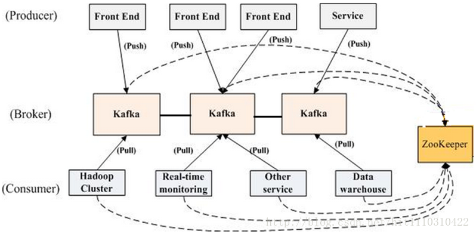
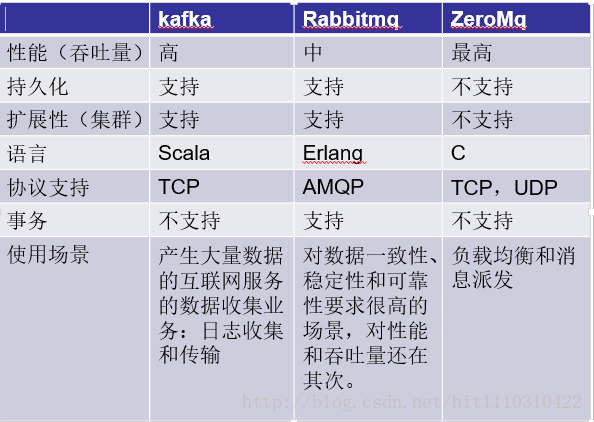
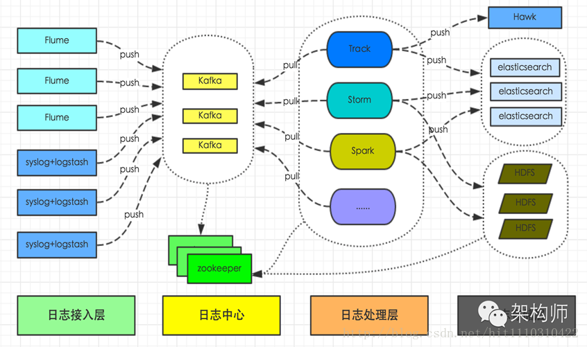

# 背景
起源于Linkedin，在apache开源，基于发布订阅的分布式消息系统。

# 特点
高吞吐量：单机每秒几百MB的读写 
消息持久化 
高扩展性 
高可靠性 
支持多消费者（这个是比较重要的特点）

# 拓扑结构
Broker：Kafka集群包含一个或多个服务器，这种服务器被称为broker 
Producer: 负责发布消息到Kafka broker 
Consumer: 消息消费者，向Kafka broker读取消息的客户端 
Consumer Group: 每个Consumer属于一个特定的Consumer Group 

1. broker、producer、consumer这三个在所有消息队列中都有。这里注意一下consumer group的概念,如图所示，hadoop cluster、real-time monitoring、otherservice、datawarehouse分别是四个不同的集群，每一个集群中有成百上千个消费者，但是这时候如果发送了一条helloworld的消息，这四个集群中只有四个consumer客户端可以接收到这条消息，每个集群中只有一个consumer客户端可以消费到消息。这就是kafka 支持多消费者。

2. kafka用zookeeper来做配置中心，用于协调各节点、consumer 之间的关系。但是图中的线可以看到kafka中producer并不和 zookeeper保持相连。

# 基本概念
有三个比较基础的概念。

## Topic
逻辑上的队列;
## Patition
物理上把Topic分成多个Partition; 
一个topic分布在多个broker上(为了负载均衡和备份，很多分布式组件都有这种设计，如mongodb的sharding)。
1.如上图，假设我们的kafka集群有3个broker，创建了1个topic，这个topic我们创建的时候指定它的partition为3，这时候partition就会平均分布到每个broker上，1个broker上面有一个partition(物理上分开)，但是这三个partition仍然属于同一个topic(逻辑上还是一个队列)。

2.如图所示，kafka只保证partition级别的有序。

# 适用场景

kafka在业界的使用主要还是用来处理日志，因为像flink、storm、spark这些大数据中间件和kafka对接得很好，也可以用来做业务逻辑处理，主要是多消费者的情况,同学们可以结合自己的情况做方案设计。 
前段时间《架构师》上面推送了《有赞日志统一平台初探》，这是有赞团队的日志处理系统，其他的日志处理系统也大同小异。包括日志接入、日志传输、日志处理、日志存储。在日志处理的时候由于支持多消费者，可以在这里用spark做实时数据分析，也可以直接在这里做简单的处理做重要日志备份、也可以根据业务需要做离线的日志分析。 

# 参考
[kafka官方文档](http://kafka.apache.org/)
[有赞日志统一平台](http://tech.youzan.com/you-zan-tong-ri-zhi-ping-tai-chu-tan/?utm_source=tuicool&utm_medium=referral)

> 程序员在跟宇宙赛跑，他们在努力开发出更大更好的傻瓜程序，而宇宙则努力培养出更大更好的白痴。到目前为止，宇宙领先。Rich Cook