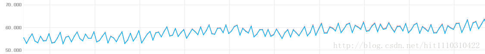

# 1.自身日志量过大的问题
kafka运行一段时间之后，会发现它的主机磁盘使用率在缓慢增长，查看数据日志的持有量还是之前设置的阈值。 

这时候其实是kafka自身的日志打印撑爆磁盘。 
默认的`~/kafka_2.11-0.9.0.0/config/log4j.properties`如下：

```
log4j.rootLogger=INFO, stdout 
log4j.appender.stdout=org.apache.log4j.ConsoleAppender
log4j.appender.stdout.layout=org.apache.log4j.PatternLayout
log4j.appender.stdout.layout.ConversionPattern=[%d] %p %m (%c)%n
log4j.appender.kafkaAppender=org.apache.log4j.DailyRollingFileAppender
log4j.appender.kafkaAppender.DatePattern='.'yyyy-MM-dd-HH
log4j.appender.kafkaAppender.File=${kafka.logs.dir}/server.log
log4j.appender.kafkaAppender.layout=org.apache.log4j.PatternLayout
log4j.appender.kafkaAppender.layout.ConversionPattern=[%d] %p %m (%c)%n
...
...
...
```
可以看到它自身日志是按照小时去备份的，而且没有自动清除的功能，所以自身日志一直没有清掉，就可能会影响到对数据量的预估和判断。这时候我们只想保留最近n天的日志。log4j并没有配置这样的功能，在不改动源码的情况下，有两种办法达到目的。
​    1. 写一个crontab的脚本自动清除；
​    2. 修改log4j.properties，按照大小去自动清除。


```
log4j.rootLogger=INFO, stdout 

log4j.appender.stdout=org.apache.log4j.ConsoleAppender
log4j.appender.stdout.layout=org.apache.log4j.PatternLayout
log4j.appender.stdout.layout.ConversionPattern=[%d] %p %m (%c)%n

log4j.appender.kafkaAppender=org.apache.log4j.RollingFileAppender
log4j.appender.kafkaAppender.append=true
log4j.appender.kafkaAppender.maxBackupIndex=2
log4j.appender.kafkaAppender.maxFileSize=5MB
log4j.appender.kafkaAppender.File=${kafka.logs.dir}/server.log
log4j.appender.kafkaAppender.layout=org.apache.log4j.PatternLayout
log4j.appender.kafkaAppender.layout.ConversionPattern=[%d] %p %m (%c)%n
...
...
...
```
如上，我本人在生产环境设置的是日志备份两个，5MB就开始回滚。
# log.retention.bytes是partition级别的
官网的解释是：The maximum size of the log before deleting it，解释得不清楚，实际上这个值**只是partition日志的大小**，不是topic的日志大小。
# log.segment.delete.delay.ms设置
The amount of time to wait before deleting a file from the filesystem。

这个值默认的是:60000ms,也就是数据量达到设定的阈值之后，还是会保留数据，等待一段时间之后才会从文件系统上删除，所以做性能测试的时候，如果数据发送速率很大，那么就会导致监控数据文件夹的时候发现它总是超出阈值才删除，可以把这个阈值设置小一点。

> 怎么做对是科学，怎么做好则是艺术。——王小波