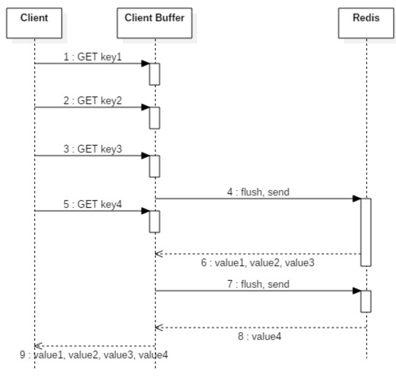
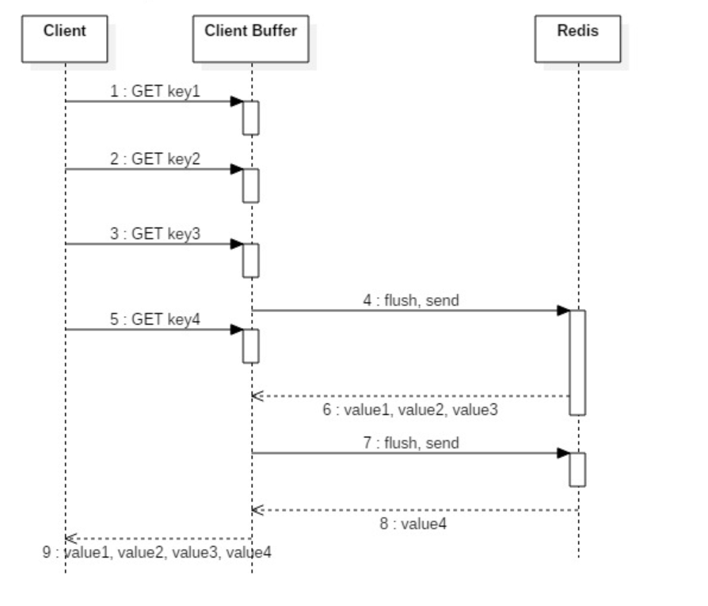
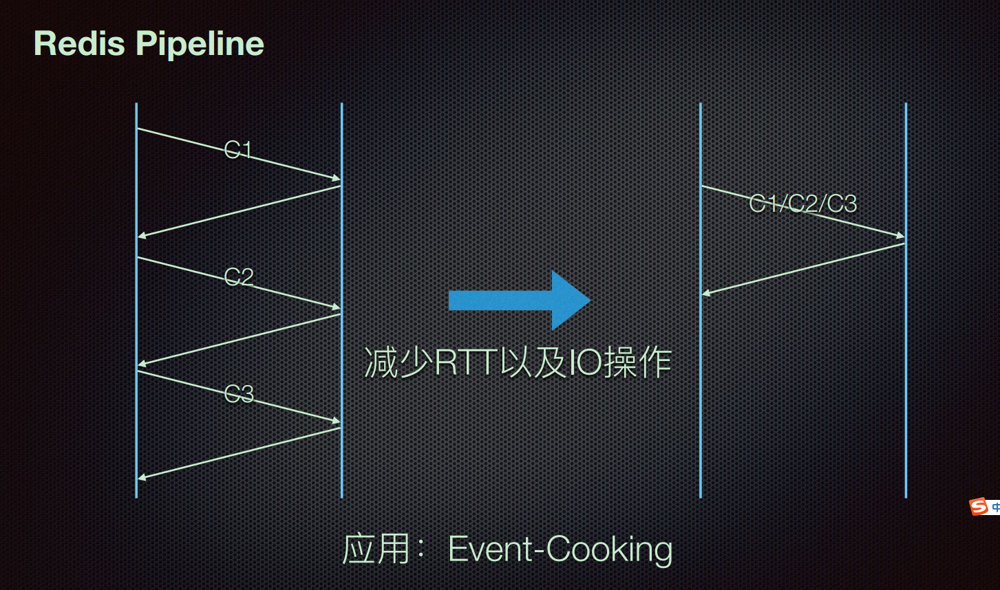

# Redis pipeline解决的问题

Redis本身是基于Request/Response协议的，正常情况下，客户端发送一个命令，等待Redis应答，Redis在接收到命令，处理后应答。在这种情况下，如果同时需要执行大量的命令，那就是等待上一条命令应答后再执行，这中间不仅仅多了RTT（Round Time Trip），而且还频繁的调用系统IO。

为了提升效率，这时候Pipeline出现了，它允许客户端可以一次发送多条命令，而不等待上一条命令执行的结果，**不仅减少了RTT，同时也减少了IO调用次数（IO调用涉及到用户态到内核态之间的切换）**。

# 优化点

* 减少往返的时间
* 减少IO系统调用。一个read系统调用，需要从用户态，切换到内核态。

# 实现

要支持Pipeline，其实既要服务端的支持，也要客户端支持。对于服务端来说，所需要的是能够处理一个客户端通过同一个TCP连接发来的多个命令，可以理解为，这里将多个命令切分，和处理单个命令一样（之前老生常谈的黏包现象），Redis就是这样处理的。而客户端，则是要将多个命令缓存起来，缓冲区满了就发送，然后再写缓冲，最后才处理Redis的应答，如Jedis。

源码层面是用一个**队列**去实现的。

在内部使用的是Jedis，JedisCluster不支持集群模式。发过去Jedis客户端之后先做Slot的计算，然后再group的发到每一个Slot。

# 应用场景

* 为什么Event-Cooking拉取kafka要使用Batch拉取的模式？是为了方便写的时候使用。

