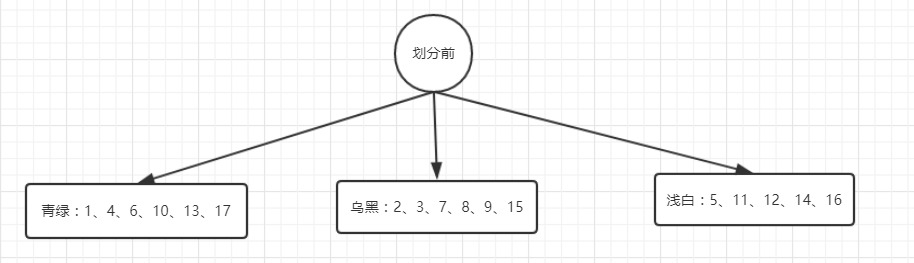

决策树是一类机器学习算法，执行过程很容易理解，这里不做赘述。决策树(上)主要关注如何创建决策树，其中涉及到一些信息论的基本概念的理解，并编码实现。决策树的剪枝放在决策树(下)。

要构建决策树关键就是划分的选择。这里涉及到6个概念，分别是：

- 信息熵(information entropy)
- 条件信息熵(conditional information entropy)
- 信息增益(information gain)
- 信息增益率(information gain perent)
- 基尼系数(gini index)
- 基尼值

# 熵和信息增益

要选择用哪个特征进行决策树划分。我们可以这么思考问题：决策树划分的目的就是通过划分把相同label的数据放到一起，不同的label我们可以理解为 **数据混乱程度**，划分的目的就是**减少数据的混乱程度**。选择每一个feature进行划分都可以减少数据混乱，我们选择减少混乱程度最大的 那个可以更快的达到目的。怎么知道选择哪个feature进行划分减少的混乱程度最大，我们考察**划分之后的数据混乱程度** ，划分之后混乱程度越小，我们就选择谁进行划分。

| 概念    | 类比              | 定义               | 备注                        |
| ----- | :-------------- | ---------------- | ------------------------- |
| 信息熵   | 数据混乱程度          | 随机变量的不确定性        | 随机变量不确定性越大、数据混乱程度越大、信息熵越高 |
| 信息增益  | 减少的数据混乱程度       | 不确定性的减少程度        | 减少程度越大、信息增益越大             |
| 条件信息熵 | 经过某一个划分后数据的混乱程度 | 在某个条件下的不确定性的减少程度 | 信息增益=信息熵 -条件信息熵           |

信息熵定义: $ H(X)=- \sum_{i}^{|labels|}p(x{i})\log_{2}p(x{i}) $ ,为什么这么定义可以参考:[为什么信息熵要定义成-Σp*log(p)？](https://www.zhihu.com/question/30828247)

条件信息熵定义:  $ {\displaystyle \mathrm {H} (X|Y)=-\sum _{i,j}p(x_{i},y_{j})\log_{2} {\frac {p(x_{i},y_{j})}{p(y_{j})}}} $

信息增益=信息熵 - 条件信息熵

为方便理解，我们用一组数据来模拟这个过程。

因为是二分类问题，|labels| = 2, 

划分前的信息熵为: $ Ent(D) = - \sum_{i}^{2}p_{i}log_{2}p_{i}=-({\frac{8}{17}}log_{2}{\frac{8}{17}}+{\frac{9}{17}}log_{2}{\frac{9}{17}}) $

以"色泽"划分为例，划分为三个节点：青绿、乌黑、浅白。每个节点计算条件信息熵为：

$ Ent(D_{色泽})  = -({\frac{3}{6}}log_{2}{\frac{3}{6}}+{\frac{3}{6}}log_{2}{\frac{3}{6}}) $

$ Ent(D_ {乌黑})  = -({\frac{4}{6}}log_{2}{\frac{4}{6}}+{\frac{2}{6}}log_{2}{\frac{2}{6}}) $

$ Ent(D_ {浅白})  = -({\frac{1}{5}}log_{2}{\frac{1}{5}}+{\frac{4}{5}}log_{2}{\frac{4}{5}}) $

$  IG(色泽) = 划分前的信息熵 - 划分后的信息熵 $

$ = Ent(D) - \sum( 每个节点的权重 * 该节点的信息熵) $

$= Ent(D) - \sum _{v=1}^{划分后的节点个数} \frac{|D_{v}|}{|D|}Ent(D_{v}) $

$ = \frac{6}{17} Ent(D_{乌黑})  + \frac{6}{17} Ent(D_{青绿}) + \frac{5}{17} Ent(D_{浅白})$

同理可以求出IG(根缔)、IG(敲声)...，选取信息增益最大的，即可最大限度的减少划分前的数据混乱程度，作为决策树的划分条件，递归的对每一个节点进行划分就可以构建决策树了。ID3算法就是选取信息增益最大的属性作为划分的。

下面我们编码实现这一过程，毕竟原理搞懂了，谁简历上不是精通C++、python、java等多门编程语言呢，见[github](https://github.com/Acceml/machine_learning)...

# 信息增益率(information gain perent)

在对上面数据的模拟过程中，如果我们用编号属性进行划分，$ Ent(D_{1})$、$ Ent(D_{2})$... 都是 0，GI(编号)=Ent(D)，是所有属性中信息增益最大的，因为划分后直接把信息混乱程度降为0了，但是这样的决策树并不具有**泛化能力**。

$GainRatio(D, a) = \frac{Gain(D,a)}{IV(a)} $

其中IV叫做属性a的故有值，定义如下:

$IV(a) =- \sum_{v=1}^{V}\frac{|D_{v}|}{|D|}log_{2}{\frac{|D_{v}|}{|D|}}$

其中v是划分后的取值，取值数目越多，IV越大，增益率就越小。

# 基尼系数(gini index)

基尼系数较为简单，它表示：从数据集中随机抽取两个样本，label不一样的概率。

基尼值：$Gini(D_{v}) = 1-\sum_{k=1}^{2}p_{k}^2$

每个节点的基尼系数加一个权重，就得到基尼系数的定义。

基尼系数：$GiniIndex(D, a) = \sum_{v=1}^{V}\frac{|D_{v}|}{|D|}Gini(D_{v})$

选取划分之后基尼系数最小的属性作为最优划分属性，基尼系数越小，那么数据混乱的程度越小。

# 决策树算法

总结一下几种决策树算法的划分准则。

- ID3 --- **信息增益** **最大**的准则
- C4.5 --- **信息增益比最大**的准则
- CART
  - 回归树: **平方误差** **最小** 的准则
  - 分类树: **基尼系数** **最小**的准则

# 决策树的剪枝

## 为什么剪枝

剪枝是为了防止过拟合，增加决策树的泛化能力。

## 剪枝 的方法

采用留出法，一部分sample用于生成决策树（训练集），另一部分样本用来检测决策树的泛化能力（验证集）。泛化能力怎么衡量呢?就是划分前后正确率。

| 剪枝方法 | 优点             | 缺点                                       |
| ---- | -------------- | ---------------------------------------- |
| 预剪枝  | 减小过拟合          | 可能会欠拟合(基于贪心思想，某次划分不能提升泛化就认为之后的划分不能提升泛化能力) |
| 后剪枝  | 减小过拟合，一般也不会欠拟合 | 存储大                                      |

# 参考资料

- [维基百科](https://zh.wikipedia.org/wiki/%E7%86%B5_(%E4%BF%A1%E6%81%AF%E8%AE%BA))
- 《机器学习》(周志华)
- [为什么信息熵要定义成-Σp*log(p)？](https://www.zhihu.com/question/30828247)

