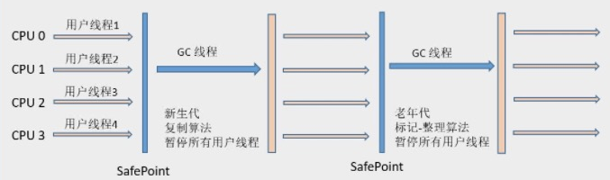
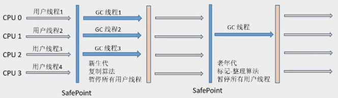
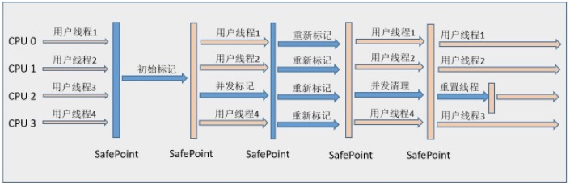

为什么会有那么多垃圾收集器?因为根据对象的特点，例如对象的生命周期、大小，进行分代以后有不同的垃圾回收算法，每种算法的具体实现和侧重点不同，就有众多的垃圾回收器。不存在什么优劣之分.

# 并行和并发

- **并行（Parallel）**：指多条垃圾收集线程并行工作，但此时用户线程仍然处于等待状态。
- **并发（Concurrent）**：指用户线程与垃圾收集线程同时执行（但不一定是并行的，可能会交替执行），用户程序在继续运行。而垃圾收集程序运行在另一个CPU上。

# 吞吐量 vs 停顿时间

$吞吐量 = {\frac{运行用户代码的时间}{运行用户代码时间+垃圾回收时间}}$

eg: 虚拟机总共运行了100min，垃圾回收花掉1min, 吞吐量为：99%

**停顿时间缩短是以牺牲吞吐量和新生代空间为代价的**。

新生代空间缩小 -> 停顿时间缩短 -> GC频繁 -> **GC的总时间增加**-> 吞吐量下降 

# Serial Garbage Collector

## 工作原理

* 单线程，只会使用一个CPU，一条线程去完成垃圾回收工作
* 进行垃圾回收的时候必须要暂停所有工作线程
* 采用复制算法
* 新生代

## 应用

Client模式（分配的内存少）下不错的选择

# Parallel Garbage Collector

**ParNew**收集器就是Serial收集器的多线程版本.

## 工作原理

* 也是stop the word，只是GC的时候是多线程
* **-XX:ParallerGCThreads**可以设置线程数目，默认是CPU的数目。
* 采用复制算法
* 新生代

## 应用

* 只有它可以和CMS配合
* Server模式下的虚拟机中首选的新生代收集器

# Parallel Scavenge Garbage Collector 

## 工作原理

* 目标是达到一个可控制的 **吞吐量**
* 老年代

## 应用

* 吞吐量高，停顿时间就长。不适合哪种需要与用户交互的程序，在后台运算不需要太多交互的任务。
* Parallel Scavenge收集器无法与CMS收集器配合使用
* 采用复制算法

# Serial Old Garbage Collector

## 工作原理

* Serial Old 是 Serial收集器的老年代版本
* 单线程
* 采用标记整理算法

## 应用

* 老年代

# Parallel Old Garbage Collector 

## 工作原理

* 多线程
* 吞吐量优先

## 应用

- 老年代

# CMS（Concurrent Mark Sweep）

### 工作原理

* 获取最短回收停顿时间为目标
* 标记-清除算法

### 步骤

( **注意哪些阶段是停顿的**)

- **初始标记（CMS initial mark）**：仅仅只是标记一下GC Roots能直接关联到的对象，速度很快，需要“Stop The World”。
- **并发标记（CMS concurrent mark）**：进行**GC Roots Tracing**的过程，在整个过程中耗时最长。
- **重新标记（CMS remark）**：为了修正并发标记期间因用户程序继续运作而导致标记产生变动的那一部分对象的标记记录，这个阶段的停顿时间一般会比初始标记阶段稍长一些，但远比并发标记的时间短。此阶段也需要“Stop The World”。
- **并发清除（CMS concurrent sweep）**

### 不足

- **对CPU资源非常敏感** 其实，面向并发设计的程序都对CPU资源比较敏感。在并发阶段，它虽然不会导致用户线程停顿，但会因为占用了一部分线程（或者说CPU资源）而导致应用程序变慢，总吞吐量会降低。**CMS默认启动的回收线程数是（CPU数量+3）/4**，也就是当CPU在4个以上时，并发回收时垃圾收集线程不少于25%的CPU资源，并且随着CPU数量的增加而下降。但是**当CPU不足4个时（比如2个），CMS对用户程序的影响就可能变得很大**，如果本来CPU负载就比较大，还要分出一半的运算能力去执行收集器线程，就可能导致用户程序的执行速度忽然降低了50%，其实也让人无法接受。
- **无法处理浮动垃圾（Floating Garbage）** 由于CMS**并发清理** 阶段用户线程还在运行着，伴随程序运行自然就还会有新的垃圾不断产生。
- **标记-清除算法导致的空间碎片**。

### 应用

- 老年代
- 对时间敏感的任务，比如互联网网站

# G1

关于G1垃圾回收器是目前生产环境用的垃圾回收器，准备用一篇文章结合GC日志进行单独讲解。

# 对比

| 收集器                   | 串行、并行or并发 | 新生代/老年代 | 算法         | 目标     | 适用场景                      |
| --------------------- | --------- | ------- | ---------- | ------ | ------------------------- |
| **Serial**            | 串行        | 新生代     | 复制算法       | 响应速度优先 | 单CPU环境下的Client模式          |
| **Serial Old**        | 串行        | 老年代     | 标记-整理      | 响应速度优先 | 单CPU环境下的Client模式、CMS的后备预案 |
| **ParNew**            | 并行        | 新生代     | 复制算法       | 响应速度优先 | 多CPU环境时在Server模式下与CMS配合   |
| **Parallel Scavenge** | 并行        | 新生代     | 复制算法       | 吞吐量优先  | 在后台运算而不需要太多交互的任务          |
| **Parallel Old**      | 并行        | 老年代     | 标记-整理      | 吞吐量优先  | 在后台运算而不需要太多交互的任务          |
| **CMS**               | 并发        | 老年代     | 标记-清除      | 响应速度优先 | 集中在互联网站或B/S系统服务端上的Java应用  |
| **G1**                | 并发        | both    | 标记-整理+复制算法 | 响应速度优先 | 面向服务端应用，将来替换CMS           |

tracking-service中:`-XX:+UseConcMarkSweepGC -XX:+UseParNewGC`

delivery-service中:`+UseG1GC`

# 参考资料

* [深入理解JVM(3)——7种垃圾收集器](https://crowhawk.github.io/2017/08/15/jvm_3/)
* 周志明《深入理解java虚拟机》
* [Java Hotspot G1 GC的一些关键技术](https://tech.meituan.com/g1.html)

