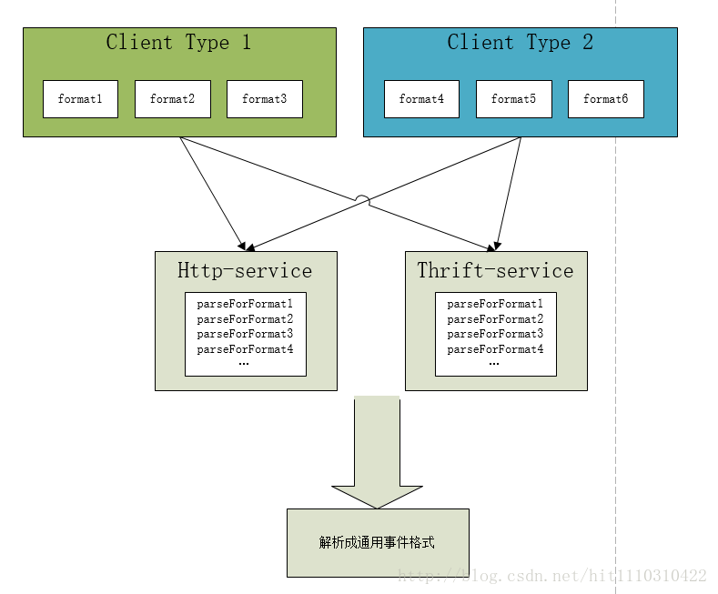
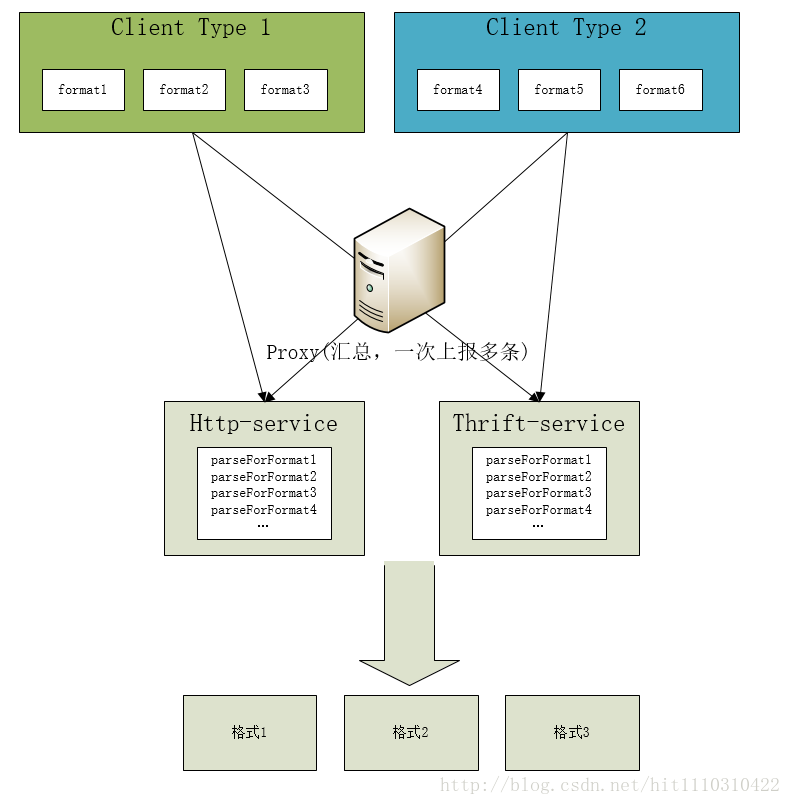

> 本文旨在介绍builder设计模式的运用。适合对builder设计模式了解，但是不知道怎么运用的同学。

# 问题背景

在当前笔者维护的广告系统中，有一个模块专门对接客户端上报的点击、曝光、下载事件，用于记录每个广告数据，供算法决策、BI报表展示给广告主。这些数据的格式不统一，使用的协议也不统一，有的是通过http有的是通过rpc调用。如下图所示，该模块的作用在于汇总各数据流、兼容新老数据格式。每种格式自己维护一套解析系统，我们的代码会显得十分的混乱。


# M-1结构

对于这样的**M to 1**的数据流，就是输入有多种格式，但是输出固定为一种格式，非常适合用builder来统一。




经典的builder模式伪代码如下:

```java
public class ActionLog {
  	ActionLog(){
      ...
      ...
  	}
	public static final class Builder {
      	private final String requiredParams;
      	private final String optionalParams;
      	Builder(String requiredParams) {
        
      	}
      
     	public Builder withOptionalParams() {
        	...
      	}
      	public ActionLog build() {return new ActionLog(this);}
	}
}
```

可参考《effective java》chapter1。这里谈一个细节，为什么这个内部静态类需要define 为final的? builder封装了构造的过程，在还没有构造完成时，允许使用提供的`withOptionalParams` 来构建对象，但是一旦这个对象确定下来，就不允许改变，得到最终想要的ActionLog。

# M-N结构

通常的业务场景都不是一种数据格式可以搞定的，可能需要生成多种数据格式。如下游需要送到kafka、hdfs、hive表、thrift调用等。构造这些格式的`meta data` 已经包含在builder中了，所以我们只需要稍加改动即可。



```java
public class ActionLog {
  	ActionLog(){
      ...
      ...
  	}
	public static final class Builder {
      	private final String requiredParams;
      	private final String optionalParams;
      	Builder(String requiredParams) {
        
      	}
      
     	public Builder withOptionalParams() {
        	...
      	}
      	public ActionLog buildForKafka() {return new ActionLog(this);}
      	public ActionLog buildForThrift() {return new ActionLog(this);}
	}
}
```

# 多条上报

上面的两个例子都是一个请求，产生一条日志，请求层面来说是`one to one` ，有时候客户端通常会做一个proxy或者sdk，来减少请求次数，一次上报多条。

这个时候请求层面属于`M to one` 的结构。我们构造出多个builder就好，不要在builder中做额外的事情，buider保持它职能的单一性。`one request`-> `List<Builder>` -> `List<ActionLog>`

目前在开发中遇到这三种情况，基本可以cover到解析日志的各种情况。在大型系统中，数据结构的统一十分重要。FYI

> Don't be evil. 不要用 eval()。—— Google